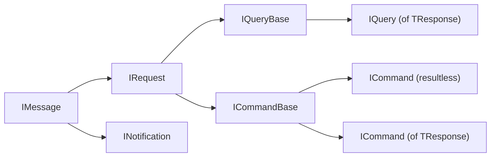

# Messages and handlers

| Kind | Message implements | Handler implements | Handlers | Response |
| --- | --- | --- | --- | --- |
| Query | `IQuery<TResponse>` | `IQueryHandler<TQuery, TResponse>` | Exactly one | Always |
| Command | `ICommand` or `ICommand<TResponse>` | `ICommandHandler<TCommand>` or `ICommandHandler<TCommand, TResponse>` | Exactly one | Optional |
| Notification | `INotification` | `INotificationHandler<TNotification>` | Zero or more | Never |

Every handler exposes a single `HandleAsync` taking the message and a `CancellationToken`, returning
`ValueTask` or `ValueTask<TResponse>`. Handlers may be `internal`, and are resolved from the current
DI scope on every dispatch.

## The marker hierarchy

All dispatchable messages implement `IMessage`. Queries and commands additionally implement `IRequest`
through their `IQueryBase` and `ICommandBase` family markers, while notifications implement `IMessage`
directly.



These markers are what [pipeline behaviors](pipeline-behaviors.md) constrain against to decide which
requests they apply to.

## Queries

A query always has a response:

```csharp
public sealed record GetOrderQuery(Guid Id) : IQuery<Order?>;

internal sealed class GetOrderQueryHandler(OrderStore store)
    : IQueryHandler<GetOrderQuery, Order?>
{
    public ValueTask<Order?> HandleAsync(
        GetOrderQuery query,
        CancellationToken cancellationToken = default) =>
        ValueTask.FromResult(store.Find(query.Id));
}
```

```csharp
var order = await queries.QueryAsync(new GetOrderQuery(id), cancellationToken);
```

## Commands

A command may return a response:

```csharp
public sealed record CreateOrderCommand(string ProductId, int Quantity)
    : ICommand<Guid>;

internal sealed class CreateOrderCommandHandler
    : ICommandHandler<CreateOrderCommand, Guid>
{
    public ValueTask<Guid> HandleAsync(
        CreateOrderCommand command,
        CancellationToken cancellationToken = default) =>
        ValueTask.FromResult(Guid.NewGuid());
}
```

Or it may be resultless:

```csharp
public sealed record ClearOrdersCommand : ICommand;

internal sealed class ClearOrdersCommandHandler
    : ICommandHandler<ClearOrdersCommand>
{
    public ValueTask HandleAsync(
        ClearOrdersCommand command,
        CancellationToken cancellationToken = default) =>
        ValueTask.CompletedTask;
}
```

Execute both forms with `ExecuteAsync`:

```csharp
var orderId = await commands.ExecuteAsync(
    new CreateOrderCommand("keyboard", 2),
    cancellationToken);

await commands.ExecuteAsync(new ClearOrdersCommand(), cancellationToken);
```

A resultless `ICommand` is adapted to `Unit` only inside the pipeline; its public handler and dispatch
methods remain resultless.

## Notifications

Notifications can have zero or more handlers, and run **sequentially in registration order**.
Publishing one with no handlers is a no-op.

```csharp
public sealed record OrderCreated(Guid OrderId) : INotification;

internal sealed class RecordOrderCreated
    : INotificationHandler<OrderCreated>
{
    public ValueTask HandleAsync(
        OrderCreated notification,
        CancellationToken cancellationToken = default)
    {
        Console.WriteLine($"Order {notification.OrderId} was created.");
        return ValueTask.CompletedTask;
    }
}
```

```csharp
await notifications.PublishAsync(new OrderCreated(orderId), cancellationToken);
```

### Open generic handlers

An open generic notification handler can observe every compatible known concrete notification:

```csharp
internal sealed class AuditHandler<TNotification>
    : INotificationHandler<TNotification>
    where TNotification : INotification
{
    public ValueTask HandleAsync(
        TNotification notification,
        CancellationToken cancellationToken = default) =>
        ValueTask.CompletedTask;
}

builder.Services.AddNotificationHandler(typeof(AuditHandler<>));
```

Assembly scanning and generated handler registration discover this canonical shape automatically.
Dispatcher first invokes the one selected closed notification route, then compatible open handlers in
registration order, closed over the concrete published type.

> [!IMPORTANT]
> Open handlers are registered as their own services and therefore do not appear in
> `IEnumerable<INotificationHandler<TNotification>>`. That enumerable remains the closed-handler view.

## Missing and duplicate handlers

Queries and commands require exactly one selected handler. A missing handler throws
`HandlerNotFoundException` at dispatch; duplicate handlers for the same handled message type throw
`DuplicateHandlerException` when the registry is created. Notifications have no such requirement.

"Compatible" is broader than an exact type match. See [Routing](routing.md).
