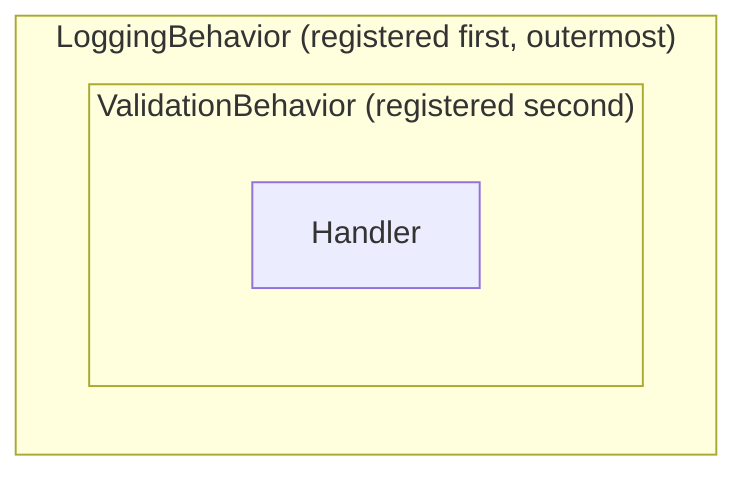

# Pipeline behaviors

Pipeline behaviors apply cross-cutting work (logging, validation, retries, transactions) around
queries and commands:

```csharp
internal sealed class LoggingBehavior<TRequest, TResponse>
    : IPipelineBehavior<TRequest, TResponse>
    where TRequest : IRequest
{
    public async ValueTask<TResponse> HandleAsync(
        TRequest request,
        RequestHandlerDelegate<TResponse> next,
        CancellationToken cancellationToken = default)
    {
        Console.WriteLine($"Executing {typeof(TRequest).Name}");
        return await next(cancellationToken);
    }
}
```

Register an open generic behavior:

```csharp
builder.Services.AddPipelineBehavior(typeof(LoggingBehavior<,>));
```

## Ordering and short-circuiting

The **first registered behavior is the outermost**. Behaviors may short-circuit by returning without
calling `next`, and they may pass a replacement cancellation token to `next`.



A request enters the outermost behavior, travels inward to the handler, and the response unwinds back
out through each behavior in reverse.

Registering the same behavior more than once is safe: the first registration wins and later ones are
ignored, so a behavior never runs twice in one pipeline.

## Targeting requests with constraints

The same `IPipelineBehavior<TRequest, TResponse>` contract handles queries and both command shapes. A
resultless `ICommand` is adapted to `Unit` only inside the pipeline; its public handler and dispatch
methods remain resultless.

The constraint on `TRequest` decides which requests a behavior applies to:

| Constraint | Applies to |
| --- | --- |
| `IRequest` | Every query and command |
| `IQueryBase` | Queries only |
| `ICommandBase` | Both command shapes |
| `ICommand` | Resultless commands only |
| `ICommand<TResponse>` | Response-bearing commands only |

The constraint is the only targeting mechanism you need. See the
[marker hierarchy](messages.md#the-marker-hierarchy).

> [!NOTE]
> Pipeline behaviors apply to queries and commands, **not notifications**.

When no behavior applies, Dispatcher takes a direct handler path and skips pipeline construction
entirely. Behaviors are still resolved per dispatch so scoped and transient lifetimes remain correct.
