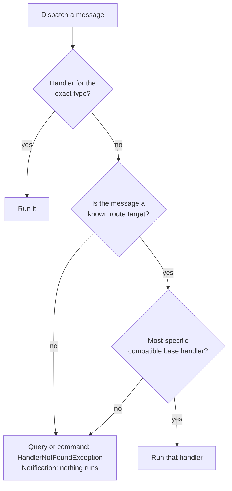

# Routing

Routing decides which handler runs for a given message, and it does so **ahead of dispatch**: during
registry creation in reflection mode, or at compile time in source-generation mode.

## Polymorphic fallback

Routes are polymorphic and precomputed, and the same resolution runs for every message kind. A
concrete message uses its **exact** handler when one exists; otherwise Dispatcher selects the
**most-specific compatible** base class or interface handler.

For a query or command, the selected handler is the one that runs. Given
`ArchiveDocumentCommand : DocumentCommand`, dispatching an `ArchiveDocumentCommand` reaches
`ICommandHandler<DocumentCommand>` when no handler for the exact type exists, as long as
`ArchiveDocumentCommand` is a known [route target](#route-targets). With nothing compatible at all,
dispatch throws `HandlerNotFoundException`.

Notifications resolve the same way, and only the outcome differs. Given
`UserCreatedEvent : DomainEvent`, publishing a `UserCreatedEvent` reaches the
`INotificationHandler<DomainEvent>` handlers under the same conditions, and publishing with nothing
compatible does nothing instead of throwing.



A message type is selected this way, and then:

- **Query and command dispatch** invokes the single handler for the selected type, including that
  type's pipeline behaviors.
- **Notification dispatch** invokes every registered handler for that one selected type, sequentially
  in registration order. It does not broadcast across the inheritance hierarchy, so a handler for the
  derived type and a handler for its base type never both run. Compatible open generic handlers still
  run afterwards, as described in [Messages and handlers](messages.md#open-generic-handlers).
- **Unrelated equally specific candidates** make the route ambiguous. The reflection implementation
  throws `AmbiguousHandlerException` during registry creation, and source generation reports a
  compiler diagnostic. Neither defers the failure to dispatch.

> [!NOTE]
> Ambiguity and duplication are always startup-time or build-time failures. Dispatch never has to
> decide between two candidate handlers.

## Route targets

A fallback route is precomputed only for concrete message types Dispatcher knows about, its **route
targets**. How a type becomes one depends on the mode:

| Mode | Route targets come from |
| --- | --- |
| Reflection | Handler assemblies, plus the assemblies that declare their handled message types |
| Source generation | The same assemblies, plus concrete messages declared by the generated host |

This supports shared contracts assemblies without scanning every application and framework reference.

### When you must register a route target explicitly

The reflection implementation cannot discover a derived message declared in an otherwise unrelated
assembly. When handlers are registered only through the typed registration methods, or when a derived
type lives outside the discovered assemblies, explicitly register each concrete type that needs a
precomputed fallback route:

```csharp
builder.Services
    .AddQueryHandler<BaseQuery, Result, BaseQueryHandler>()
    .AddDispatcherMessage<DerivedQuery>();
```

> [!WARNING]
> Without that route target the derived type has no fallback route, and the base handler is never
> reached: dispatching `DerivedQuery` throws `HandlerNotFoundException`, and publishing a derived
> notification finds no handler and does nothing.

`AddDispatcherMessage` applies to the **reflection-based implementation only**. Source-generated
routes must be known at build time from the generated host, a generated handler module, or an
assembly that declares one of the handled message types.

## Common surprises

| Symptom | Likely cause |
| --- | --- |
| `HandlerNotFoundException` on a derived type that has a base handler | The derived type is not a route target; add `AddDispatcherMessage<T>()` |
| A published notification does nothing | Same cause, in the kind that fails silently |
| Base and derived handlers both expected to run | Notification dispatch selects one type; it does not broadcast up the hierarchy |
| `DuplicateHandlerException` at startup | Two handlers registered for the same handled message type, often a factory registration on top of scanning |
| `AmbiguousHandlerException` at startup, or a build error | Two unrelated equally specific candidate handlers |

The factory-registration case is explained under
[current limitations](../reference.md#factory-registrations).
