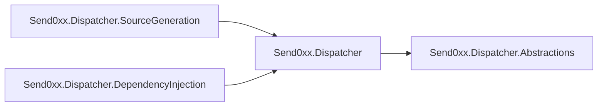

# Reference

## Packages



| Package                                  | Contains                                                                                                    |
|------------------------------------------|-------------------------------------------------------------------------------------------------------------|
| `Send0xx.Dispatcher.Abstractions`        | Messages, handlers, pipeline contracts, dispatcher interfaces, and `Unit`                                   |
| `Send0xx.Dispatcher`                     | Typed Microsoft DI registration extensions, and Dispatcher and telemetry options                            |
| `Send0xx.Dispatcher.DependencyInjection` | The reflection-based implementation, registry, wrappers, handler scanning, pipelines, and telemetry runtime |
| `Send0xx.Dispatcher.SourceGeneration`    | The source-generation analyzer, referencing the shared runtime APIs for trimming and Native AOT             |

> [!IMPORTANT]
> Most applications should reference either `Send0xx.Dispatcher.DependencyInjection` **or**
> `Send0xx.Dispatcher.SourceGeneration`, not every package individually.

Package IDs use the `Send0xx` prefix. Core APIs remain in the `Dispatcher` namespace, while generator opt-in attributes
and generated registration extensions use `Dispatcher.SourceGeneration`.

## Current limitations

- Notifications execute **sequentially** rather than concurrently.
- Pipeline behaviors apply to queries and commands, **not** notifications.

### Factory registrations

Registering a handler or behavior through a factory delegate is not recommended when it is also covered by scanning or a
typed registration method. Duplicate registrations are otherwise detected and ignored, but Microsoft DI does not expose
the type a factory returns, so a factory registration cannot be matched against another one. Both survive:

| Registered twice         | Result                                                   |
|--------------------------|----------------------------------------------------------|
| Notification handler     | Fires twice per publish                                  |
| Pipeline behavior        | Runs twice per request                                   |
| Query or command handler | `DuplicateHandlerException` when the registry is created |

Each factory below duplicates a registration made earlier in the same setup:

```csharp
builder.Services
    .AddDispatcher()
    // Registers every query, command, and notification handler in the assembly,
    // including RecordOrderCreated and GetOrderQueryHandler. Behaviors are not scanned.
    .AddDispatcherHandlers(typeof(Program).Assembly);

builder.Services.AddPipelineBehavior(typeof(LoggingBehavior<,>));

// Not recommended. Scanning already registered RecordOrderCreated, but this
// descriptor reports no implementation type, so the duplicate goes undetected
// and the handler fires twice on every publish.
builder.Services.AddScoped<INotificationHandler<OrderCreated>>(
    _ => new RecordOrderCreated());

// Not recommended. The open generic behavior above already applies to
// GetOrderQuery, so this closes it a second time and it runs twice per request.
builder.Services.AddScoped<IPipelineBehavior<GetOrderQuery, Order?>>(
    _ => new LoggingBehavior<GetOrderQuery, Order?>());

// Not recommended. For a query or command handler this is a startup failure:
// creating the registry throws DuplicateHandlerException.
builder.Services.AddScoped<IQueryHandler<GetOrderQuery, Order?>>(
    provider => new GetOrderQueryHandler(provider.GetRequiredService<OrderStore>()));
```

Register by type instead, or as an instance. Both expose an implementation type, so a repeat of something already
registered is detected and ignored:

```csharp
builder.Services
    .AddDispatcher()
    // The same scan as above.
    .AddDispatcherHandlers(typeof(Program).Assembly);

// Repeating a scanned handler by type is detected and ignored.
builder.Services.AddNotificationHandler<OrderCreated, RecordOrderCreated>();
builder.Services.AddPipelineBehavior(typeof(LoggingBehavior<,>));

// Constructor dependencies come from the container, so no factory is needed.
builder.Services.AddScoped<OrderStore>();
```
